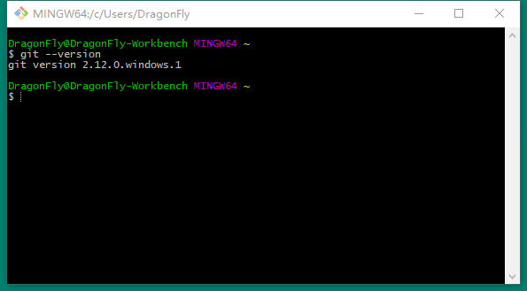

## 安装

### Windows

下载 git 在 Windows 系统上的客户端：[Git for Windows](https://gitforwindows.org/)。
安装文件为exe格式，直接打开按照默认安装即可。
打开Git Bash，输入如下指令获取客户端版本信息。

``` bash
$ git --version
```



完成安装之后，就可以使用命令行的git工具（已经自带了ssh客户端）了，另外还有一个图形界面的git项目管理工具。

给 Windows 用户的敬告：你应该在msysGit提供的Unix风格的shell来运行git。在Unix风格的shell中，可以使用复杂多行的命令。对于那些需要在Windows命令行中使用git的用户，必须注意：在参数中间有空格的时候，必须使用双引号将参数括起来（在Linux中是单引号）；另外，如果扬抑符（^）作为参数的结尾，并且作为这一行的最后一个字符，则这个参数也需要用双引号括起来。因为扬抑符在 Windows 命令行中表示续行。

### Linux

如果要在Linux上安装预编译好的git二进制安装包，可以直接用系统提供的包管理工具。

在Fedora或CentOS上用 yum 安装：

``` bash
$ sudo yum install git-core
```

在 Ubuntu 这类 Debian 体系的系统上，可以用 apt-get 安装：

``` bash
$ apt-get install git
```

### MacOS

在MacOS上安装git有两种方式。
最容易的当属使用图形化的git安装工具。
另一种是通过MacPorts安装。
如果已经装好了MacPorts，用下面的命令安装git：

``` bash
$ sudo port install git-core +svn +doc +bash_completion +gitweb
```

这种方式就不需要再自己安装依赖库了，Macports 会帮你搞定这些麻烦事。一般上面列出的安装选项已经够用，要是你想用git连接subversion的代码仓库，还可以加上`+svn`选项。
