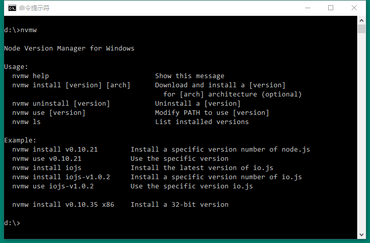
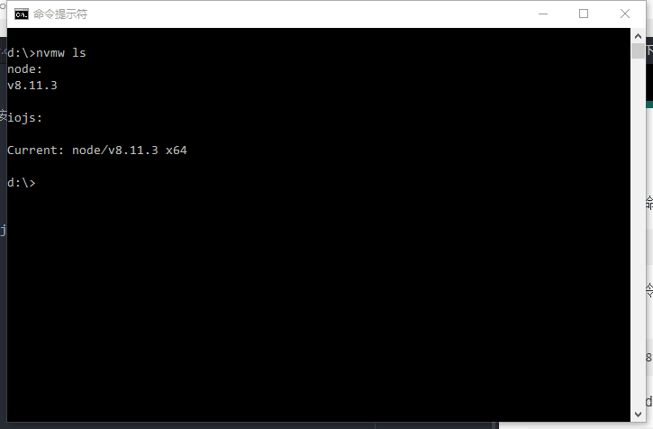
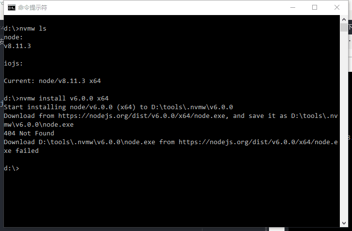
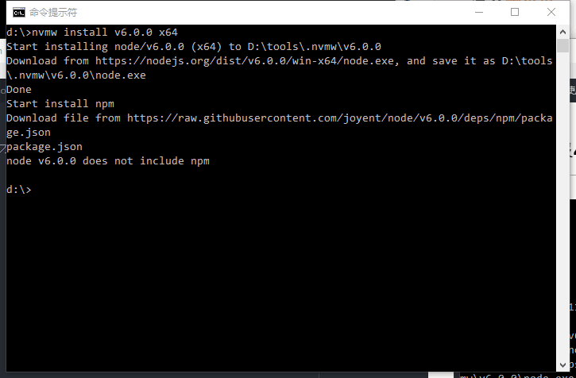
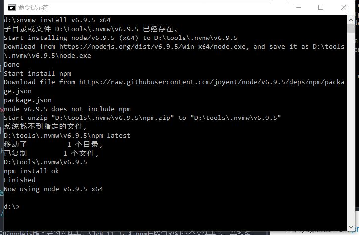

## 前言

nvmw工具是nvm在Windows操作系统上的实现。它提供了一个环境，使得开发者可以在Windows操作系统中同时安装多个版本的nodejs，并在多个版本间妥善地切换。**作者在github上已经声明停止维护。**

## 安装

在控制台执行以下语句，默认从github上将nvmw下载到`%HOMEDRIVE%%HOMEPATH%\.nvmw`，一般是`C:\Users\Administrator`路径：

``` bash
> git clone git://github.com/hakobera/nvmw.git "%HOMEDRIVE%%HOMEPATH%\.nvmw"
```

配置环境变量PATH，使用控制台命令，在当前控制台有效：

``` bash
> set "PATH=%HOMEDRIVE%%HOMEPATH%\.nvmw;%PATH%"
```

在Windows的控制面板中配置环境变量，可长期有效。

配置环境变量后，可直接在控制台执行`nvmw`命令。



## 使用

在控制台使用以下命令查看当前安装了哪些版本的nodejs：

``` bash
> nvmw ls
```

必须是通过以下命令安装的nodejs才能通过nvmw查看得到，受到nvmw的管理，版本号就是所要安装的nodejs版本：

``` bash
> nvmw install v8.11.3
```

卸载某版本的的nodejs：

``` bash
> nvmw uninstall v8.11.3
```

当前使用某版本的nodejs：

``` bash
> nvmw use v8.11.3
```



## 问题

### 下载nodejs报404 Not Found



修改nvmw安装目录下的文件nvmw.bat中137行将x64改为win-x64，这里把资源路径写错了。

### nodejs不包含npm



自己从github下载[npm](https://github.com/npm/npm)的zip包。

在nvmw安装目录下创建名为要安装的nodejs版本号的文件夹，如v8.11.3。将npm压缩包放到这个文件夹下，并改名为npm.zip。

这样就可以继续安装了，在解压zip的过程中可能会报文件名过长的问题，跳过即可没什么影响。


