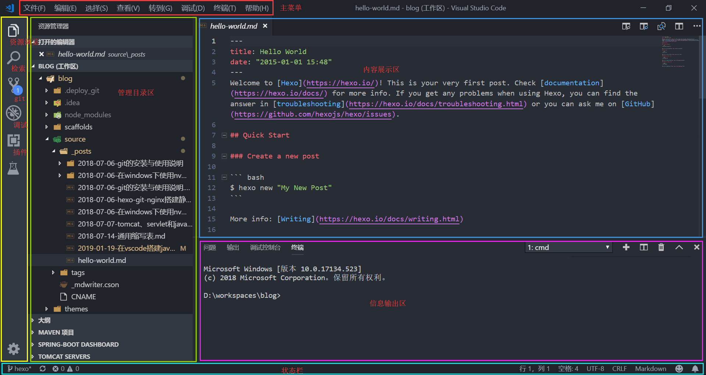

## vscode简介

vscode，英文全称叫Visual Studio Code，照搬官网文档上的原话，是一个娇小又强壮的源代码编辑器，可以运行在Windows，macOS和Linux等操作系统的桌面之上，内置对JavaScript、TypeScript和Node.js的支持，而且拥有丰富的插件生态系统，可通过安装插件支持C++、C#、Java、Python、PHP、Go等其他语言，以及.NET、Unity等的运行环境。

## vscode与atom比较

因为github的缘故，用过一段时间的atom。甫一看，这难不成是哥俩儿吧，窗口布局、状态栏的陈列连插件的名字都雷同。微软把这个弄成开源的不冤啊，要不然不想被说碰瓷都难。不过好就好在微软是个会做产品的主儿，虽然说是开源，但是一板一眼的做的都是那么回事。反观atom，主意还是有的，借着github的东风无缝集成、插件的生态系统、轻量级的定位，但还是怎么看怎么像github的客户端，在用户体验上下的功夫少呢，似乎是在创意方面很有兴趣去加强，却不会花很大心思去优化提升。这样下去，插件越加越臃肿，迟早会塞成下一个eclipse。

vscode在用户体验上表现得比较突出，基本上是以程序员工作上比较重要的几个点展开的：编代码、调试、检索、提交、扩展功能，性能和UI方面，没有查过资料，但相信是优化过的。这些方面做得不错的产品，更容易俘获人心和上手入门吧。微软的这个切入点从产品规划等方面来看很受用的。剩下的功能方面嘛，当然该有的都得有，说是用户很关心这些，让开发者拍胸脯说无需关心更像一个优秀的产品该有的样子。

## vscode与idea比较

从eclipse到idea，再到vscode、sublime、atom这些，说是流行大势，我认为实际上是对编程这个工作本源的回归。当年告别用命令行、记事本打代码的时代，各种IDE纷纷上马，有的号称支持所有编程语言、有的号称可运行在所有操作系统平台、还有的每个季度都到多集成进几个开发框架。可是话说回来，平时又有多少人要一遍遍的新建工程，替换框架，同时使用多种语言，做出来的程序要运行到各种各样的平台上去？是的，的确是不确定的某天会用到，但我觉得这个工具静静的安装在电脑上，或者说是安装在项目组的某台公用PC上，该用的时候用一下，不也就满足需要了吗？我的个人电脑上需要的只是一个非常好用的编辑器，调试器，能够便捷地同步代码，利用maven、npm等工具构建可执行的软件包。从eclipse到idea是第一步，再到vscode可能是第二步吧。

## 运行环境

* 操作系统：Windows 10
* JDK：1.8.0_172
* Maven：3.5.4
* VSCode：1.30

## 安装

官网地址是：[https://code.visualstudio.com/](https://code.visualstudio.com/)，安装过程很顺，没什么特别要调的要配的。

## 布局




## 插件

到左边从上数第四个图标“扩展(Ctrl+Shift+X)”，点进去，检索安装一下插件：

* Chinese (Simplified) Language Pack for Visual Studio Code 这个是微软提供的简体中文包
* Atom One Dark Theme 黑乎乎的时髦主题
* vscode-icons 花里胡哨的目录树图标
* Java Extension Pack Java语言的扩展包，还自带安装其他几个插件：
  * Language Support for Java™ by Red Hat
  * Debugger for Java 调试
  * Java Test Runner 测试
  * Java Dependency Viewer 依赖关系
* Maven for Java 支持Maven
* Spring Boot Extension Pack 这是个Spring Boot扩展包，开发Spring Boot可以安一下

## 设置

注意左下角还有个齿轮似的图标，是设置菜单，点击设置打开设置标签页，点击标签页标签右边的中括号进入设置的JSON文件。把个性化的配置写到右半边。

``` bash
{
    "workbench.iconTheme": "vscode-icons",
    "workbench.colorTheme": "Atom One Dark",
    "java.errors.incompleteClasspath.severity": "ignore",
    "terminal.explorerKind": "integrated",
    "terminal.integrated.shell.windows": "C:\\Windows\\System32\\cmd.exe",
    "git.path": "D:\\tools\\Git\\bin\\git.exe",
    "java.home": "D:\\tools\\Java\\jdk1.8.0_172",
    "java.configuration.maven.userSettings": "D:\\tools\\Maven\\apache-maven-3.5.4\\conf\\settings.xml",
    "maven.excludedFolders": [
        "**/.*",
        "**/node_modules",
        "**/target",
        "**/bin"
    ],
    "maven.executable.path": "D:\\tools\\Maven\\apache-maven-3.5.4\\bin\\mvn.cmd",
    "maven.terminal.useJavaHome": true,
    "maven.terminal.customEnv": [
        {
            "environmentVariable": "JAVA_HOME",
            "value": "D:\\tools\\Java\\jdk1.8.0_172"
        }
    ],
    "files.associations": {
        "*.java": "java"
    },
    "files.autoSave": "afterDelay",
}
```

## 快捷键

* 显示所有命令 Ctrl+Shift+P
* 转到文件 Ctrl+P
* 在文件中查找 Ctrl+Shift+F
* 开始调试 F5
* 切换终端 Ctrl+`

## 用法

### 提纲

既然是简单的开发工具，就不要想着功能有多强大，用起来的话，主要靠四点：
1 Git怎么用
2 使用命令
3 使用cmd
4 插件正确

### Git怎么用

基本上还是靠CMD+Git命令把工程拉取到本地的工程目录。把工程目录加到工作区才能开始我们的开发工作。

提供的Git支持实际上就是Git命令的翻版，修改过的文件会自动列出来，先点更改一栏的加号按钮暂存，再点该功能目录对应的栏目头部的对勾按钮提交，在点左下角状态栏上的刷新按钮拉取推送，就达到提交代码的目的了。

有了Git管理代码，剩下在本地就可以愉快地作了。

### 使用命令

Ctrl+Shift+P可以召唤出一个输入命令的框，想找java项目相关的命令就输入java，想找git相关的命令就输入git，想找spring相关的就输入spring，简单的几个命令就会检索出来，完成创建、编译什么的操作。也不需要怎么记，用熟的就那几个。

### 使用CMD

工具实在不称手还有咱终端窗口呢，用之前还是先把环境变量配置好，什么JAVA_HOME，PATH，CLASSPATH，M2_HOME的，比点按钮省事。

### 插件正确

插件是挺好用，但是时常也会抛锚，留意这个目录C:\Users\<当前用户>\AppData\Roaming\Code\User\workspaceStorage，不行就删掉重启。相当于初始化又重新加载了一下工作区。