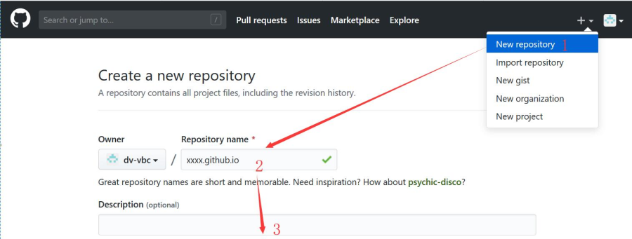
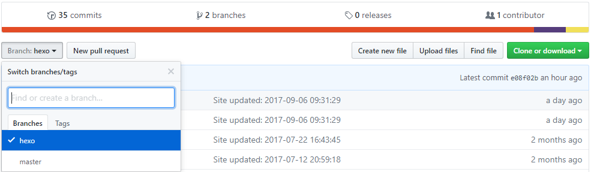
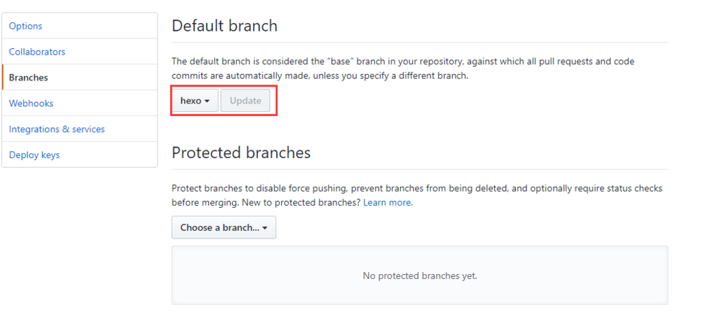
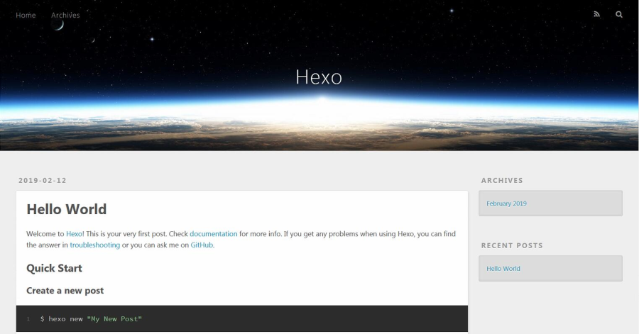
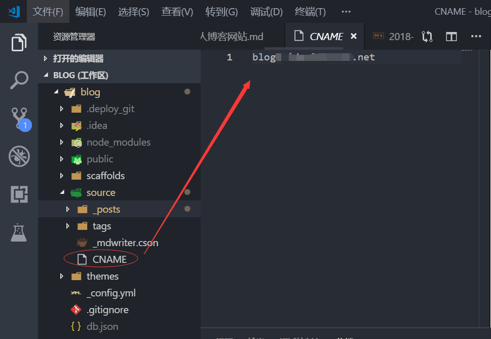
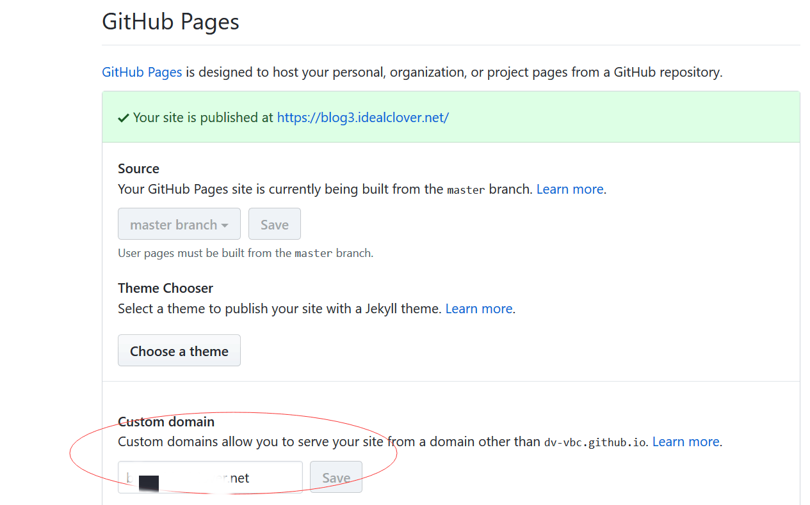
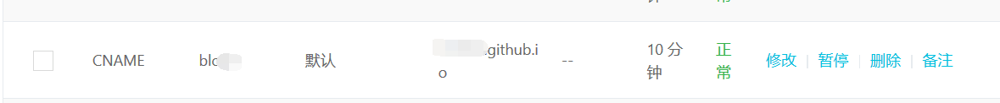

## GitHub Pages

GitHub Pages 是一个静态网站主机服务，不支持 PHP、Ruby、Python 等服务端代码，它提供的网页须被管理在 GitHub 资源库中。

官网上有三点使用指导：
* 创建于2016年6月15日之后并且使用了 github.io 域名的 GitHub Pages 网站被提供了 HTTPS 服务，而之前的网站需要手动激活 HTTPS 支持。
* GitHub Pages 网站不能用于像传送密码或者信用卡号这样的敏感交易。
* GitHub Pages 从属于《GitHub服务条款》，不得被拿来转卖。

GitHub Pages 网站须遵从如下使用限制：
* GitHub Pages 代码库建议限于1GB。
* 发布后的 GitHub Pages 网站不要大于1GB。
* GitHub Pages 网站有每个月100GB的柔性带宽限制。
* GitHub Pages 网站有每个小时10次构建的柔性限制。

另外鉴于 GitHub 不允许被用来做商务活动，有若干网站内容上的限制：
* 服务条款或社区指导不允许或以其他方式禁止的内容或活动。
* 暴力恐怖的内容或活动。
* 过多的自动化批量活动，如垃圾邮件。
* 危害 GitHub 用户或服务的活动。
* 成功学的内容。
* 淫秽色情的内容。
* 不符合站长身份和网站目的的内容。

## Hexo

Hexo 是一个快速、简洁且高效的博客框架。Hexo 使用 Markdown（或其他渲染引擎）解析文章，在几秒内，即可利用靓丽的主题生成静态网页。

## 部署环境

* node.js：10.15.0
* git：2.19.1.windows.1
* hexo-cli：1.1.0
* vscode：1.31.0

## 工作要点

* 使用 Hexo 搭建静态博客网站。
* 使用 GitHub Pages 发布网站。
* 在 GitHub 上创建分支管理 Hexo 的本地编译环境。
* 绑定网站的域名。
* 调整网站的主题、名称、图标、版块等。
* 明确网站的维护流程。

## 实施步骤

### 准备 GitHub 帐号

#### 本地环境

[安装Git客户端](../2018-07-06-git的安装与使用说明/)。
[配置Git客户端]()。

#### 新建资源库

新建一个资源库（ new repository ），命名一定是该帐号的 github 的用户名( username )加上 .github.io ，这个仓库的全称命名就是 username.github.io ，然后点击页面下方的 create repository 按钮。

建立资源库后，点击 ssh ，看到 git@github.com:username/username.github.io.git 然后复制（ copy ），以备后续使用。

#### 新建分支

在 Github 的 username.github.io 仓库上新建一个 xxx 分支，并切换到该分支，并在该仓库->Settings->Branches->Default branch 中将默认分支设为 xxx ，save 保存；然后将该仓库克隆到本地，进入该 username.github.io 文件目录。



#### git 获取分支代码

使用 git bash。
第一步：先从git上clone一个下来
``` bash
$ git clone git@github.com:username/username.github.io.git
```
第二步：进入该文件夹内
``` bash
$ cd username.github.io.git
```
第三步：创建一个分支并与远程分支关联
``` bash
$ git checkout -b hexo-cli-1.1.0<本地分支> origin/hexo-cli-1.1.0<远程分支>
```
第四步：把代码拉下来。
``` bash
$ git pull
```

### 准备 Hexo 本地编译环境

#### 安装

安装 Hexo 相当简单。然而在安装前，您必须检查电脑中是否已安装下列应用程序：
* [Node.js](../2018-07-06-在windows下使用nvmw管理nodejs版本/)
* [Git](../2018-07-06-git的安装与使用说明/)

如果您的电脑中已经安装上述必备程序，那么恭喜您！接下来只需要使用 npm 即可完成 Hexo 的安装。
``` bash
> npm install -g hexo-cli
```

#### 建站

安装 Hexo 完成后，请执行下列命令，Hexo 将会在指定文件夹中新建所需要的文件。
``` bash
> hexo init <folder>
> cd <folder>
> npm install
```
新建完成后，指定文件夹的目录如下：
```
.
├── _config.yml
├── package.json
├── scaffolds
├── source
|   ├── _drafts
|   └── _posts
└── themes
```

##### _config.yml

网站的 配置 信息，您可以在此配置大部分的参数。

##### package.json

应用程序的信息。EJS, Stylus 和 Markdown renderer 已默认安装，您可以自由移除。
``` json
//package.json
{
  "name": "hexo-site",
  "version": "0.0.0",
  "private": true,
  "hexo": {
    "version": ""
  },
  "dependencies": {
    "hexo": "^3.0.0",
    "hexo-generator-archive": "^0.1.0",
    "hexo-generator-category": "^0.1.0",
    "hexo-generator-index": "^0.1.0",
    "hexo-generator-tag": "^0.1.0",
    "hexo-renderer-ejs": "^0.1.0",
    "hexo-renderer-stylus": "^0.2.0",
    "hexo-renderer-marked": "^0.2.4",
    "hexo-server": "^0.1.2"
  }
}
```

##### scaffolds

模版 文件夹。当您新建文章时，Hexo 会根据 scaffold 来建立文件。

Hexo的模板是指在新建的markdown文件中默认填充的内容。例如，如果您修改scaffold/post.md中的Front-matter内容，那么每次新建一篇文章时都会包含这个修改。

##### source

资源文件夹是存放用户资源的地方。除 _posts 文件夹之外，开头命名为 _ (下划线)的文件 / 文件夹和隐藏的文件将会被忽略。Markdown 和 HTML 文件会被解析并放到 public 文件夹，而其他文件会被拷贝过去。

##### themes

主题文件夹。Hexo 会根据主题来生成静态页面。

#### 预览

将.md文件渲染成静态文件，然后启动服务：
``` bash
> hexo g
> hexo server
```
控制台反馈以下内容：
``` bash
INFO  Start processing
INFO  Hexo is running at http://localhost:4000 . Press Ctrl+C to stop.
```
现在便可以打开浏览器访问[http://localhost:4000](http://localhost:4000)来预览在本地发布的博客了。


#### 管理

将此 Hexo 编译环境覆盖到拉取的 GitHub 资源库分支中，并提交推送。
之后就可以通过此分支来维护 Hexo 的编译环境。

#### 部署

安装模块，hexo-deployer-git 。
``` bash
> npm install hexo-deployer-git
```
然后打开_config.yml，找到`deploy`节点。
``` yml
deploy:
  type: git
  repo: git@github.com:/<account>/<account>.github.io.git #<repository url>
  branch: master          #这里填写分支   [branch]
  message: 提交的信息      #自定义提交信息 (默认为 Site updated: {{ now('YYYY-MM-DD HH:mm:ss') }})
```
保存后，尝试将我们的页面部署到服务器。
``` bash
> hexo clean
> hexo generate --deploy
```

### 绑定域名

#### 添加CNAME文件

在根目录下的`source`文件夹下新建CNAME文件，没有后缀。
编辑`CNAME`文件，在里边添加你的域名信息，如图：

保存之后，重新部署到github pages上。

#### 给GitHub项目添加配置

在项目的Settings中，添加Custom domain到自己的域名：


#### 给域名添加解析记录

到域名控制台（阿里云，腾讯云，或者其他域名供应商）找到域名列表点击域名解析，添加一条`CNAME`类型的域名解析记录。

等待域名解析完成，即可通过`HTTPS`协议访问该域名，获取到`GitHub Pages`页面。

### 个性化Hexo网站

#### 安装next样式

themes文件夹中存放的是主题，默认的是landscape主题，如果你不喜欢可以安装其他主题。
NexT主题是一套简约的主题，是目前使用最火的一个主题，下面我们安装一下该主题，你也可参考安装NexT。
Hexo还有更多主题供你选择。

安装NexT主题：
``` bash
> cd XXX        #进入到项目文件夹下
> git clone https://github.com/theme-next/hexo-theme-next themes/next
```

启用NexT主题：
打开 XXX 下的`_config.yml`文件，找到theme字段将其值更改为next。

验证主题：
完成上述操作即可通过前述的预览方式验证主题是否生效。

#### 基本信息配置

打开`./_config.yml`，找到`Site`版块。
``` yml
title: 标题
subtitle: 副标题
description: 描述
author: 作者
language: 语言（简体中文是zh-Hans）
timezone: 网站时区（Hexo 默认使用您电脑的时区，不用写）
```
关于该配置文件中的其他配置可参考[站点配置](https://hexo.io/zh-cn/docs/configuration.html).

#### 资源文件夹

对于那些想要更有规律地提供图片和其他资源以及想要将他们的资源分布在各个文章上的人来说，Hexo也提供了更组织化的方式来管理资源。这个稍微有些复杂但是管理资源非常方便的功能可以通过将`config.yml`文件中的`post_asset_folder`选项设为`true`来打开。
``` yml
#_config.yml
post_asset_folder: true
```
当资源文件管理功能打开后，Hexo将会在你每一次通过`hexo new [layout] <title>` 命令创建新文章时自动创建一个文件夹。这个资源文件夹将会有与这个`markdown`文件一样的名字。将所有与你的文章有关的资源放在这个关联文件夹中之后，你可以通过相对路径来引用它们，这样你就得到了一个更简单而且方便得多的工作流。
在hexo的目录下执行
``` bash
> npm install hexo-asset-image --save
```
这样的目录结构（目录名和文章名一致），只要使用 `` 就可以插入图片。其中[]里面不写文字则没有图片标题。

#### 菜单设置

菜单可包括：首页、归档、分类、标签、关于等等。
我们刚开始默认的菜单只有首页和归档两个，不能够满足我们的要求，所以需要添加菜单，打开`./themes/next/_config.yml`找到`Menu Settings`。
``` yml
menu:
  home: / || home                          //首页
  archives: /archives/ || archive          //归档
  categories: /categories/ || th           //分类
  tags: /tags/ || tags                     //标签
  about: /about/ || user                   //关于
  #schedule: /schedule/ || calendar        //日程表
  #sitemap: /sitemap.xml || sitemap        //站点地图
  #commonweal: /404/ || heartbeat          //公益404
```
看看你需要哪个菜单就把哪个取消注释打开就行了；
关于后面的格式，以`archives: /archives/ || archive`为例：` || `之前的`/archives/`表示标题“归档”，关于标题的格式可以去`themes/next/languages/zh-CN.yml`中参考或修改。` || `之后的archive表示图标，可以去`Font Awesome`中查看或修改，`Next`主题所有的图标都来自`Font Awesome`。


### 使用Hexo的一些约定
